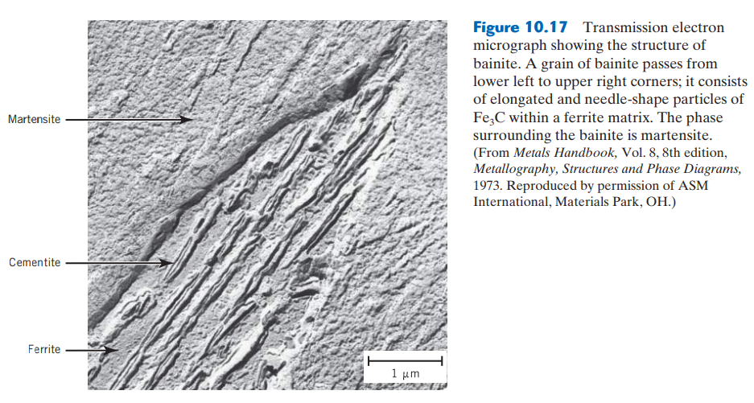
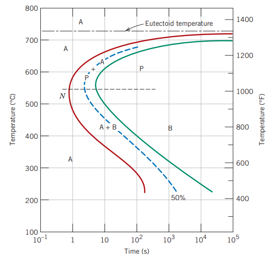
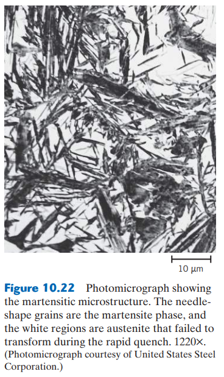
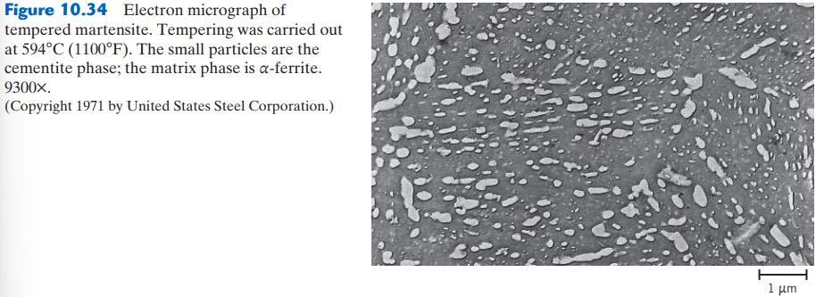
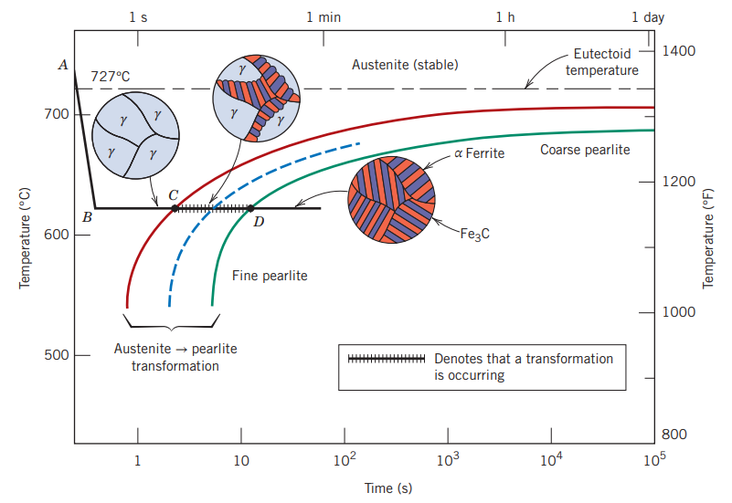
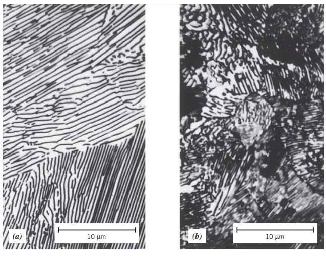

## Microestructuras

### Bainita

Se produce en conjunto con la _perlita_ en la transformación austenítica.

**Descripción:** Aparece como agujas o placas (dependiendo de la temperatura de transformación), y consiste de ferrita y cementita.

**Obtención:** Aparece luego de una transformación isotérmica luego de la austenización, a temperaturas menores a las que la perlita se forma, por lo que el gráfico siguiente es una extensión de la curva TTT entre _austenita-perlita_ para temperaturas menores.

Todas las curvas de _inicio_, _transformación_ y _fin_ tienen forma de 'C' y tienen una pronunciación mayor en el punto $N$, donde la tasa de transformación es máxima.

### Esferoidita

Es una microestructura que se obtiene luego de calentar una muestra con perlita o bainita por debajo de la temperatura de austenización por un tiempo considerable.

**Obtención:** Sólo se transforma a partir de perlita o bainita.

### Martensita

Es una microestructura o fase no estable que resulta de la transformación de austenita sin difusión, es decir, cuando el cambio de temperatura es demasiado alto, se previene la difusión de carbono.

La martensita es una microestructura muy dura y, por lo tanto, frágil, y por lo tanto no puede utilizarse en la gran mayoría de aplicaciones. Esto es producto de esfuerzos internos luego del proceso de templado por la deformación extrema de la estructura cristalina.

**Descripción:** Aparece en forma de agujas largas y distintivas, compuestas de la poca _ferrita_ y _cementita_ que se alcanzó a difundir durante el proceso. Aparece rodeada de una matriz de _austenita_ (austenita retenida) que no se transformó durante el proceso, y también puede coexistir junto con la perlita. Esto deja una red cristalina muy deformada y, por lo tanto, muy dura.

La austenita en forma FCC experimenta una transformación polimórfica a una martensita _tetragonal centrada en el cuerpo_ (BCT).

**Obtención:** Dado que la obtención de martensita no requiere difusión, ésta ocurre casi instantáneamente, por lo que no depende del tiempo, y por lo tanto, se muestra en el diagrama TTT como una línea horizontal.

La transformación de martensita inicia en la línea _M (start)_ con las líneas _M(50%)_ y _M(90%)_ indicando el porcentaje transformado de martensita a dicha temperatura.

### Martensita revenida

Es una microestructura más dúctil y tenaz que la martensita, obtenida luego de un tratamiento térmico conocido como _revenido_, que consisten en el calentamiento del acero a una temperatura menor a la eutetoide (usualmente, entre 250-650°C) por un periodo de tiempo determinado. Esto facilita la difusión del carbono, partiendo de una fase martensítica, y  resultando en dos fases homogéneas, con una microestructura de _ferrita_ y _cementita_.

En la martensita revenida, la cementita aparece como una estructura similar a la esferoidita, pero con gránulos mucho más pequeños y uniformes.

El tiempo y temperatura de revenido afectan la dureza del material. En la siguiente figura se muestra la relación entre la dureza vs. tiempo y temperatura de revenido para un acero eutectoide AISI 1080.

> **Importante:**
> - La presencia de elementos aleantes como cromo, níquel, molibdeno o tungsteno puede cambiar la posición y geometría de las líneas de los diagramas TTT, incluyendo:
>    - Aumento de los tiempos de transformación entre austenita y perlita.
>    - Formación de una región de transformación de bainita
> 
> 
> - La presencia de elementos aleantes en los aceros como manganeso, níquel o cromo, puede resultar en el incremento en su fragilidad luego del proceso de revenido, realizando el proceso a temperaturas mayores a 575°C, luego de enfriar lentamente a temperatura ambiente; o entre 375-575°C.

## Cambios en microestructura y propiedades

### Diagramas TTT

Los diagramas TTT _(time-temperature-transformation)_ muestran cuánto tiempo tomaría una transformación de una fase a otra **a una temperatura constante**.

El proceso para transformar de fase _austenita_ a _perlita_ en una aleación eutectoide a 620°C, según con el gráfico anterior, se muestra a continuación:
- **A:** Se calienta el material a temperatura de austenización, mayor a la eutectoide (727°C).
- **A-B:** Se enfría rápidamente el material hasta una temperatura de aprox. 620°C.
- **B-C:** Se mantiene dicha temperatura por aprox. 3.5 segundos para empezar la transformación.
- **C:** Empieza la transformación de austenita a perlita.
- **C-D:** Se transforma la microestructura de austenita a perlita, en un tiempo de aprox. 15 segundos, manteniendo la temperatura de 620°C.
- **D:** Termina la transformación con un 100% de perlita.

Puede verse que dependiendo de la temperatura a la que se realiza el proceso, puede obtenerse **perlita gruesa** o **perlita fina**.

