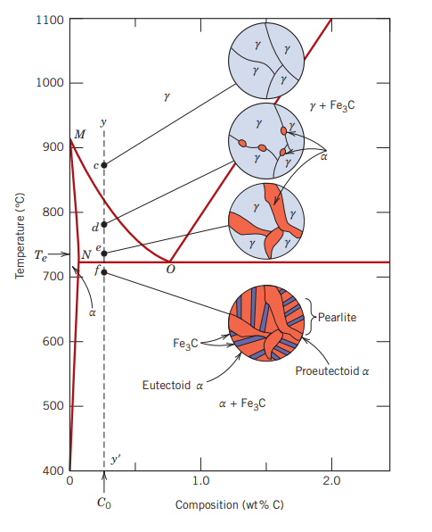
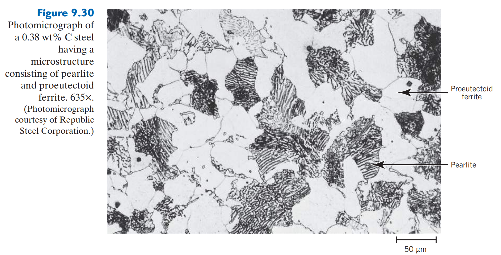
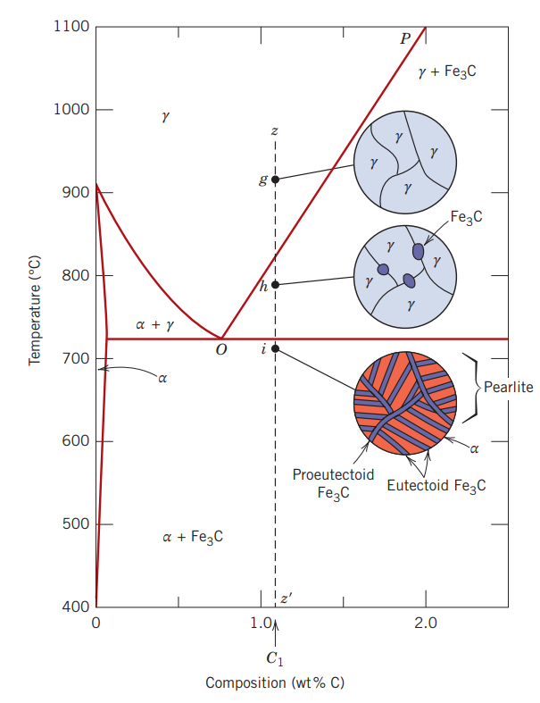
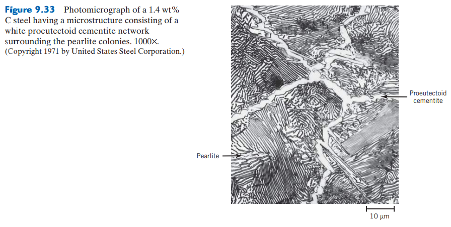

Aquí se muestran las microestructuras formadas en aleaciones de _acero hipoeutectoide_, es decir, con un porcentaje de carbono entre 0.022 y 0.76%wt C, menor a la eutectoide.

## Ferrita proeutectoide

Es una microestructura formada en una aleación con composición inferior a la eutectoide (entre 0.022 y 0.76 wt% C); es decir, en una **aleación hipoeutectoide**.

**Obtención:** Se forma al enfriar lentamente una aleción de acero con una composición previa a la eutectoide, empezando a una temperatura correspondiente a la fase $\gamma$ y terminando en una correspondiente con la fase $\alpha + Fe_3C$ (punto $f$ de la gráfica).

Esta microestructura, en estas condiciones, aparece en conjunto con la perlita. La ferrita que se encuentra dentro de la perlita se conoce como **ferrita eutectoide**.

## Aleaciones hipereutectoides

Las aleaciones de _acero hipereutectoide_ contienen entre 0.76 y 2.14wt% C, que son enfriadas desde temperaturas desde la región austenítica del diagrama Fe-C.

### Cementita proeutectoide

Es una fase que se forma antes de la reacción eutectoide

**Obtención:** Se forma al calentar una aleación hipereutectoide y dejando enfriar lentamente, y pasando por la región $\gamma + Fe_3C$. Puede verse que la cementita proeutectoide aparece a lo largo de los granos de austenita.

Al disminuir aún más la temperatura, la austenita de composición eutectoide se convierte en perlita, resultando entonces en perlita y cementita proeutectoide.

> Para aleaciones hierro-carbono de composición proeutéctica o hipereutéctica, _ferrita_ o _cementita_, respectivamente, coexisten junto con la perlita.

---

## Preguntas
- ¿Cómo es posible retener cierta fase dentro del diagrama Fe-C? Es decir, digamos que quiero obtener cementita proeutectoide + austenita. Para evitar una transformación completa a la fase inferior, ¿basta con enfriar muy rápido para evitar la transformación de fases? ¿cómo obtuvieron la microestructura de la austenita, por ejemplo, si se da solamente a tan alta temperatura?

- ¿Por qué una fase proeutectoide (ferrita o cementita) se forma a lo largo de los granos de austenita?
- ¿Qué es la eutectoide? ¿No es sólo una concentración?
  No, al parecer es un punto en el cual ocurre X. Y depende de la temperatura y composición de carbono en la aleación.
- ¿Es posible obtener diferentes fases que no deberían existir a temperatura ambiente porque se introducen aleantes en la aleación?