Este diagrama, comúnmente llamado _Fe-C_ (aunque sus componentes sean _Fe_ y $Fe_3C$), es una porción del diagrama completo _Fe-C_, que va hasta una composición de 6.70 wt% C.

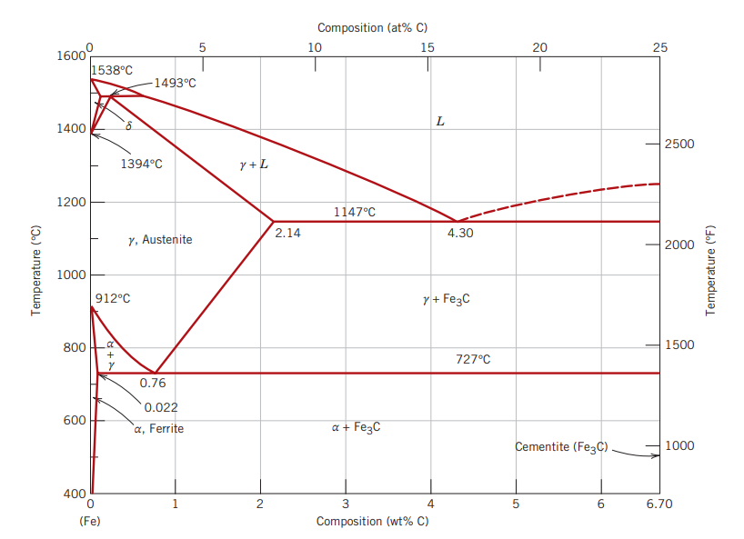

## Fases

- **Ferrita ($\alpha$)**   
  Corresponde al hierro estable. Se produce a temperatura ambiente y antes de la temperatura de austenización del hierro (912°C), y posee una estructura cristalina BCC.  
  Es una fase relativamente suave.
- **Austenita ($\gamma$)**   
  Ocurre después de la temperatura de austenización y hasta 1394°C. Posee una estructura polimórfica con cristales BCC y FCC.
- **Ferrita ($\delta$)**
  Se produce después de 1394°C. Posee una estructura cristalina BCC, y finalmente se derrite a 1538°C.  
  Es muy similar a la fase $\gamma$, pero no tiene importancia tecnológica.
- **Cementita ($Fe_3C$)**   
  También conocida como _carburos de hierro_. Ocurre a una concentración mayor o igual a 6.70 wt% C, cuando se excede el límite de solubilidad de la fase $\alpha + Fe_3C$ a temperaturas menores a 727°C.  
  Es una componente muy dura y frágil, y se utiliza en algunos aceros para mejorar sus propiedades.

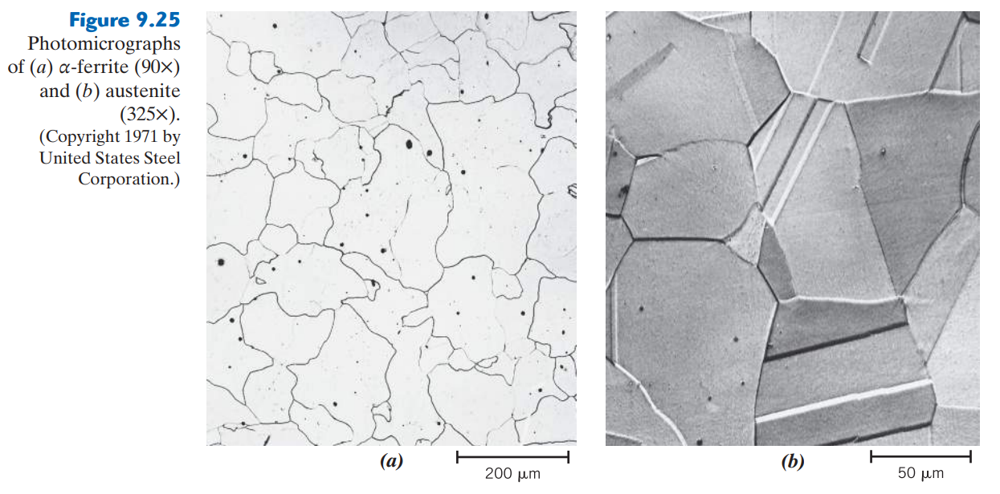

> El diagrama de fases _$Fe-Fe_3C$_ sólo va hasta un porcentaje de 6.70 wt% C, ya que sus aplicaciones más importantes en ingeniería sólo van hasta dicha composición.  
> Una composición mayor a 6.70 wt% C resultaría en hierro y grafito puro.

## Microestructuras formadas en aleaciones _Fe-C_

En una aleación Fe-C se pueden presentar diferentes microestructuras, que dependen del contenido de carbono y el tratamiento térmico.

### Perlita

**Obtención:** Esta microestructura se forma al enfriar lentamente una aleación de acero con una composición eutectoide (0.76 wt% C), que se encuentra a una temperatura tal que se encuentra en la fase $\gamma$ (austenita) - por ejemplo, a 800°C - y se deja enfriar lentamente hasta llegar a la fase $\alpha + Fe_3C$ (ferrita + cementita).

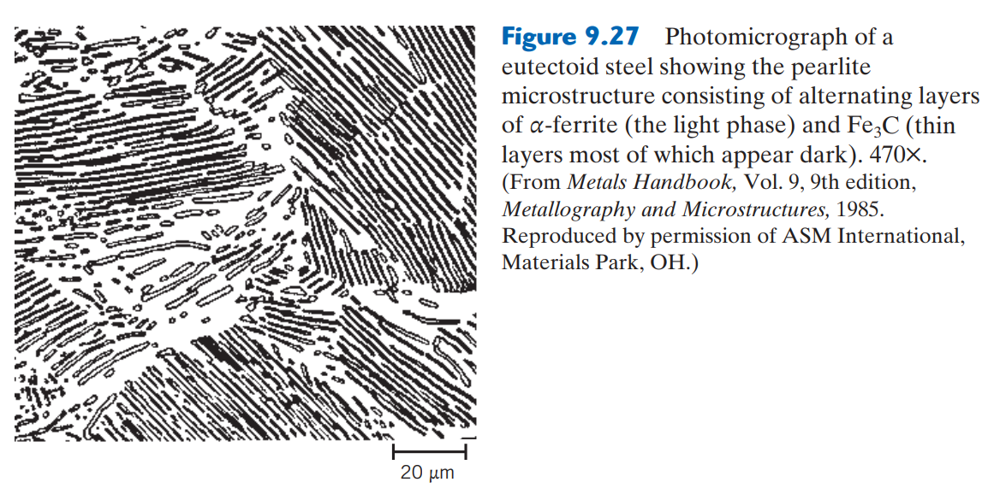

La obtención de perlita obedece a la siguiente ecuación:

$$
  \gamma (0.76 \space wt\% \space C) \space \underset{heating}{\overset{cooling}{\leftrightharpoons}} \space \alpha(0.022 \space wt\% \space C) + Fe_3C(6.7\space wt\% \space C)
$$

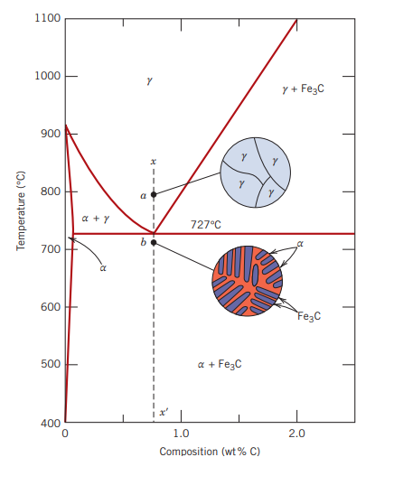

**Composición:** La _perlita_ se compone de _ferrita_ y _cementita_. La perlita existe en forma de granos, y en cada grano existen capas orientadas en la misma dirección. La matriz se encuentra en la fase $alpha$ (ferrita eutectoide), mientras que las capas delgadas están compuestas de $Fe_3C$.

**Propiedades:** Mecánicamente, la perlita posee propiedades entre las de la ferrita (dúctil y suave) y la cementita (dura y frágil).

**Mecanismo de transformación:** (ver página 310 del Callister)

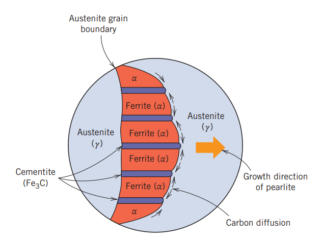

### Cementita proeutectoide

Es una microestructura formada en una aleación con composición superior a la eutectoide (entre 0.76 y 2.14 wt% C); es decir, en una **aleación hipereutectoide**.

**Obtención:** 

## Curvas TTT

También llamadas **curvas de _tiempo, temperatura y transformación_** o **diagramas de transformación isotérmica** son curvas que representan la transformación de una fase a otra (en porcentaje en peso) en función de la temperatura y el tiempo (en escala logarítmica) en que dicha temperatura se mantuvo.

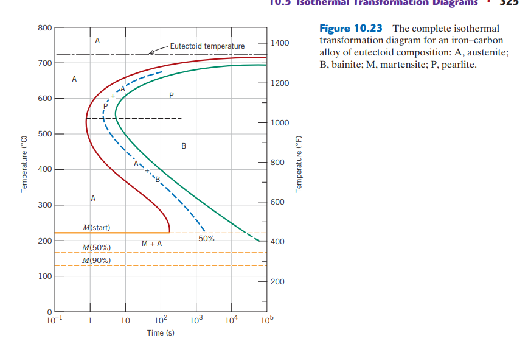

### Curva TTT de transformación de **perlita**

---

# Ejercicios

### Ejercicio: Diseño de un proceso de templado

Diseñe un proceso de templado para obtener una dureza mínima de HRC 40 en el centro de una barra de acero 4320 de 1.5 in de diámetro. ¿Es este diámetro suficiente para producir al menos 50% de martensita durante el templado?

**R.**

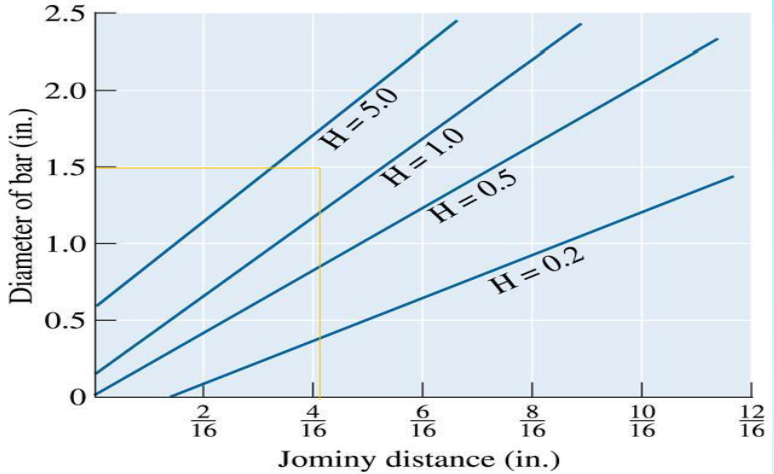

De acuerdo con los resultados de la prueba Jominy (ver gráfica), se sabe que una barra de cualquier acero de 1.5 in de diámetro tendrá una dureza de al menos HRC 40 bajo los siguientes parámetros:

| HRC | Distancia Jominy [in] | Severidad de temple (H) | Medio de templado |
|:---:|:---:|:---:|---|
| 44 | 4/16 | 4.00 | Agua agitada |
| 42 | 5/16 | 2.00 | Salmuera no agitada |
| 46 | 3/16 | 5.00 | Salmuera agitada |

Ahora, a partir de la curva Jominy de dureza, se puede ver que la dureza mínima necesaria se encuentra a una distancia Jominy de unos 6/16 in.

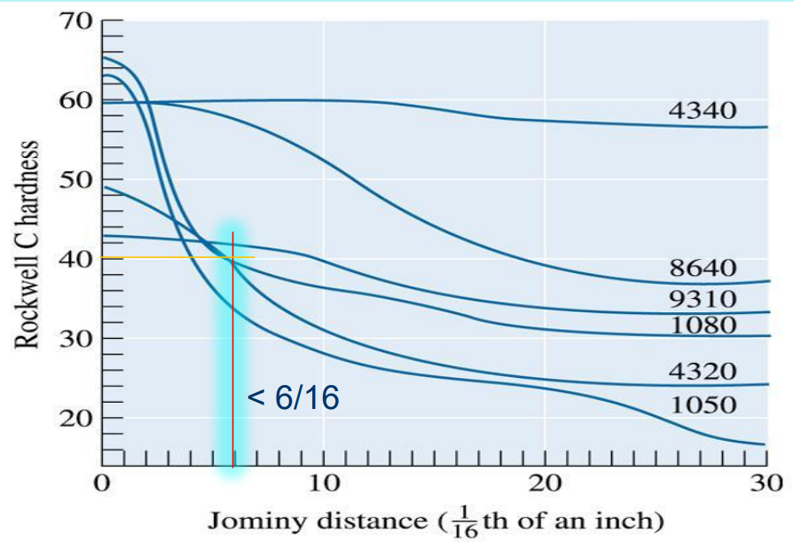

Calculando el diámetro crítico a partir de las composiciones de los aleantes del acero 4320:

$$
  DI = DI_{Jominy} \cdot f_{Mn} \cdot f_{Si} \cdot f_{Ni} \cdot f_{Cr} \cdot f_{Mo}
$$

| Aleante | Composición | $f_{aleante}$ |
|---|:---:|:---:|
| Mn | 0.6 | 3 |
| Si | 0.3 | 1.21 |
| Ni | 2 | 1.4 |
| Cr | 0.6 | 2.3 |
| Mo | 0.3 | 1.9 |
| C | 0.2 | 0.1509 |

Con un diámetro crítico ideal igual a $DI_{Jominy} = 6/16 in$, se tiene un diámetro crítico real de $DI = 1.257 in$. **Esto quiere decir que utilizando agua agitada como el medio de templado, se puede formar al menos un 50% de martensita en el centro de una barra de 1.257 in de diámetro (¿?)**. 

**Preguntas:**
- ¿Qué es el diámetro $DI$? ¿El diámetro crítico ideal o real?
- ¿Por qué el diámetro $DI$ no es igual al del ejemplo?
- ¿Qué representa la siguiente gráfica?   
  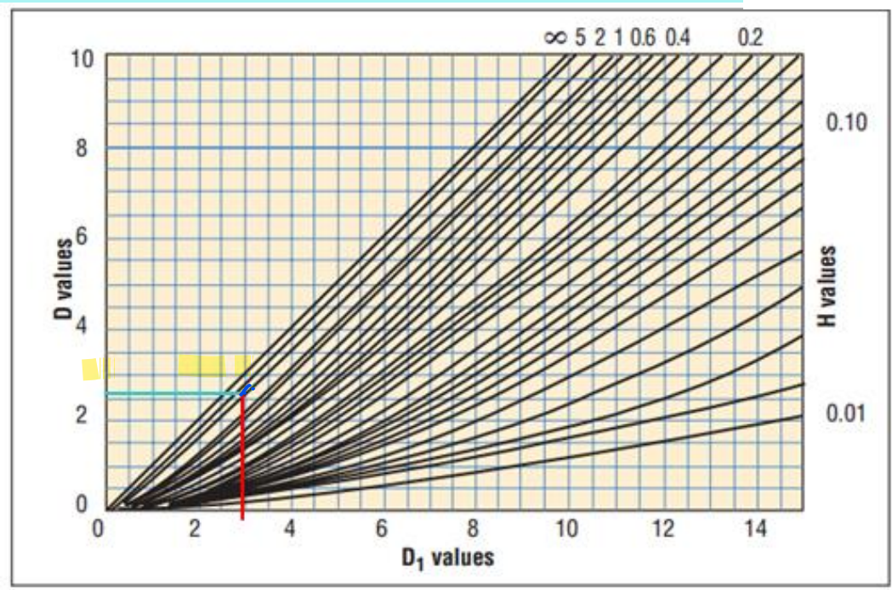

### Ejercicio: Selección de un acero comercial y su proceso de templado para aplicación en cortante

Un pin pasador de una $1in = 2.54cm = 0.0254m$ de diámetro  para un gancho de un puente grúa debe soportar una fuerza cortante máxima de 15 toneladas. Seleccione el acero comercial más adecuado para esta aplicación.

**R.**

Para la solución de este tipo de problemas de selección de aceros y sus tratamientos térmicos, es necesario:

1. Conocer las propiedades mecánicas que debe soportar el elemento.
   
   El pin pasador debe:
   - Soportar un esfuerzo máximo cortante de $\tau = 680MPa$.
   - Tener una resistencia a la fluencia mayor a $\sigma_Y = 1400MPa$.
   - Poseer una dureza final de entre 44.5 y 48.4 HRC.

2. A partir de la curva Jominy, determinar la distancia Jominy correspondiente para los materiales que se encuentran actualmente en el mercado.
   
   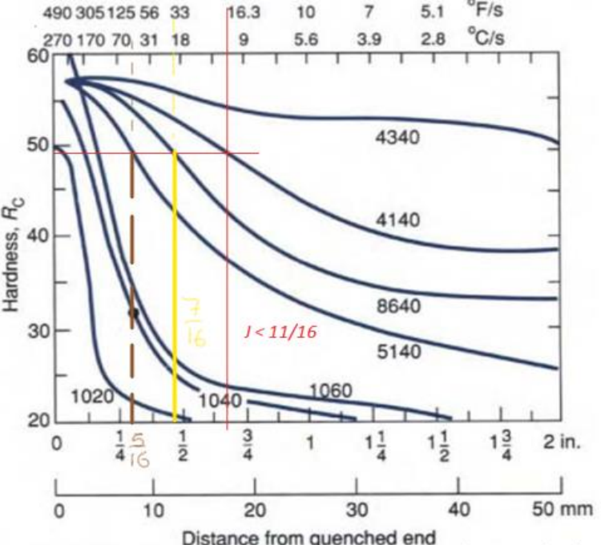

   A partir de la gráfica anterior, se tienen las siguientes distancias Jominy y sus correspondientes materiales en el mercado nacional a una dureza de 48.4 HRC:

   | Acero | Distancia Jominy aproximada [in; mm] |
   |---|:---:|
   | 1040 | 1/8; 3 |
   | 1060 | 3/16; 4 |
   | 5140 | 5/16; 8 |
   | 8640 | 7/16; 13 |
   | 4140 | 11/16; 17 |

   Fueron preseleccionados los aceros 5160, 8640 y 4140.

3. Determinar el medio de temple (a través del factor de severidad de temple, H)  a partir de la distancia Jominy.
   
   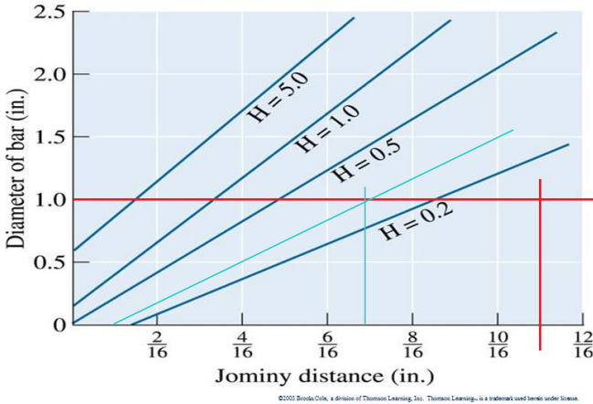

   A partir de la gráfica de templabilidad, se tiene una severidad de temple de entre 0.1 (para el acero 5140), 0.3 (para el acero 8640) y 0.5 (para el acero 4140).

   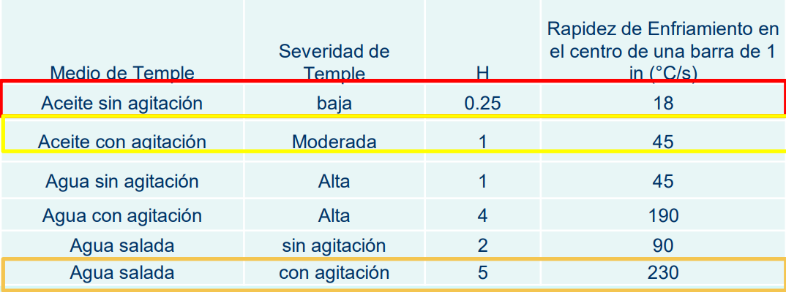

   Entonces, se selecciona el aceite (sin agitación) como medio de templado, para poder obtener un factor de severidad de temple de 0.25 (para el acero 8640).

4. Por último, seleccionar la temperatura de revenido del material elegido a partir de las condiciones de templado y la resistencia a la tracción y límite elástico deseados.

   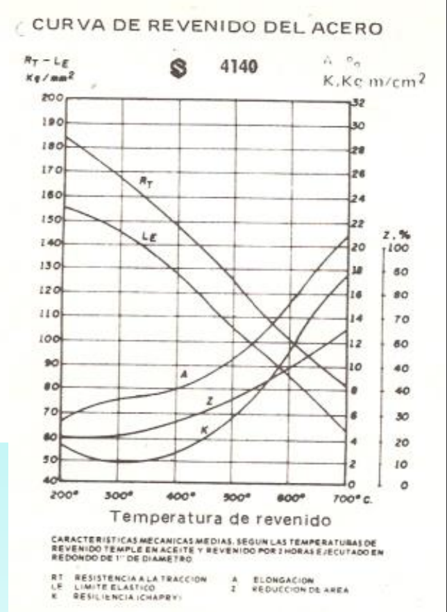

**Preguntas:**
- ¿Cómo puedo asegurar que la resistencia a la tracción corresponda con tal grado de dureza? ¿De dónde salió esa tabla?
  
  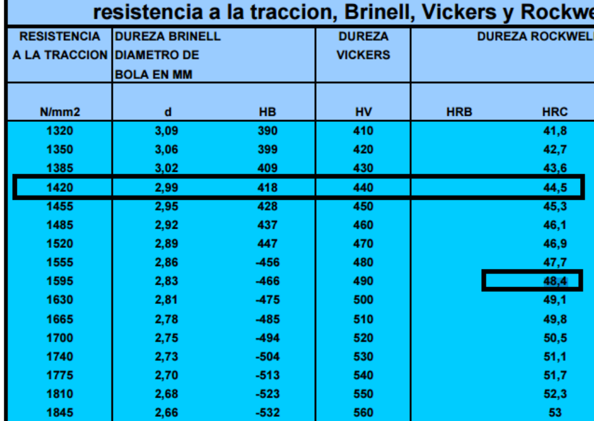

- Entre los puntos 2 y 3 se tenían tres tipos de aceros opcionados (según el ejemplo). ¿Qué acero se seleccionó al fin y por qué?
- En el punto 3, ¿por qué se seleccionó aceite? ¿Porque es el único medio que puede entregar un coeficiente de 0.25?
- ¿La severidad de temple no depende también de la temperatura a la que esté el medio? ¿Qué temperaturas se utilizan normalmente? ¿Un aceite a temperatura mayor no podría brindar una severidad de temple menor?
- ¿Cómo se lee la curva de revenido del acero? ¿Dónde puedo encontrar las condiciones de templado del material?

---

1. Entre más carbono es más duro en el material, ya que impide el movimiento de dislocaciones. La temperatura de forja permite no utilizar tanta energía mecánica, y permite la formación de martensita (dura), y permite 

2. Después de forja se realiza un templado: Austenización a 900°C, y a una velocidad alta (por el poco espesor de la espada) para formar 100% de martensita. Luego, realizar un revenido