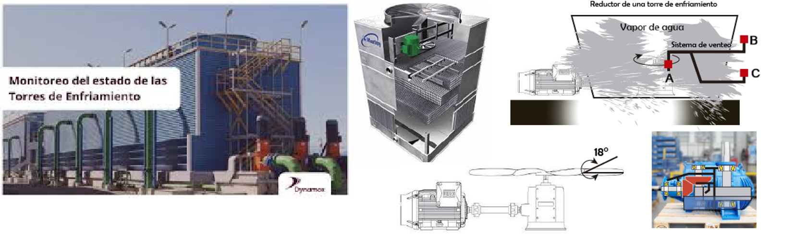

## Suposiciones
- Los materiales son macroscópicamente homogéneos e isotrópicos (mayoría de los metales y varios polímeros).
- Las cargas se aplican con lentitud y permanecen constantes en el tiempo (son estáticas).

## Falla de materiales dúctiles bajo carga estática

¿Qué es un material dúctil?

Se hace un énfasis en este tipo de materiales ya que cuando los materiales dúctiles fallan en una máquina, generalmente lo hacen cuando ceden bajo una carga estática.

La teoría más precisa para este análisis es la teoría de Von Mises-Hencky, y la preferida es la teoría del esfuerzo cortante máximo.

### Teoría de Von Mises-Hencky (Teoría de Energía de Distorsión)

**Energía total de deformación (U):** Es el área bajo la curva de esfuerzo-deformación unitaria hasta el punto donde se aplica el esfuerzo (de forma unidireccional).

$$
  U = \frac{1}{2}\sigma\epsilon
$$

Con $\sigma$: Esfuerzo aplicado, $\epsilon$: Deformación experimentada.

Ampliando a un estado de esfuerzos tridimensional:

$$
  U = \frac{1}{2}(\sigma_1\epsilon_1 + \sigma_2\epsilon_2 + \sigma_3\epsilon_3)
$$

**Carga hidrostática:** Son cargas aplicadas en todas las direcciones de una pieza, creando esfuerzos uniformes en todas las direcciones. Esto puede lograrse fácilmente colocando la muestra en una cámara de presión.

**Componentes de energía de deformación:** La energía de deformación total posee dos componentes: Una debida a la carga hidrostática (que cambia su volumen) y otra debida a la distorsión (que cambia su forma).

$$U = U_h + U_d$$   
Con $U_h$: Componente hidrostática, $U_d$: Componente de distorsión.

Entonces, el cálculo de la energía de distorsión puede realizarse de la siguente manera:

1. Expresar los esfuerzos principales en función de la componente hidrostática y de distorsión, y realizar la suma correspondiente para hallar la hidrostática:

  

  

2. Para un cambio volumétrico sin distorsión, se obtiene la componente hidrostática del esfuerzo:
   
   

3. Hallar la energía de deformación asociada a un cambio de volumen hidrostático:

     
  ...   
  

5. Hallar la energía de distorsión, restando la componente hidrostática hallada previamente de la ecuación principal:
   
     
   ...  
   

Ahora, es necesario obtener un criterio válido de falla de acuerdo con la prueba a la tensión.

> La prueba a la tensión en materiales dúctiles es la fuente principal de datos de resistencia del material.

Esto se logra haciendo $\sigma_1 = S_y, \sigma_2 = \sigma_3 = 0$. La ecuación queda:

Igualando la energía de distorsión:

   
...   
Para estado de esfuerzo **tridimensional**:   
  

Para estado de esfuerzo **bidimensional**:  
  

De forma bidimensional, esta ecuación forma una elipse:

_Elipse normalizada de $U_d$ para la resistencia a la fluencia del material_

## Falla de materiales frágiles bajo carga estática

Es necesario combinar dos teorías de falla para tener en cuenta la factura frágil por tensión y por compresión.

Dentro de los materiales frágiles existen dos categorías:

**Materiales uniformes:** Son materiales que presentan resistencias a la compresión similares o iguales a las resistencias a la tensión. (e.g. Herramientas de acero endurecido).

**Materiales no uniformes:** Materiales que presentan resistencias a la compresión comparativamente mayores a sus resistencias a la tensión. (e.g. Hierros colados grises o cerámicas).

   
_Círculos de Mohr para materiales uniformes y no uniformes en purebas de tensión y compresión_ 

> El esfuerzo normal y cortante son interdependientes en casos donde es dominante el esfuerzo de compresión. Sin embargo, el esfuerzo cortante no es un factor en materiales no uniformes, si el esfuerzo principal es el de tensión. En este caso, l**a falla se debe únicamente por el esfuerzo a tensión**.

### Teoría de Coulomb-Mohr

Es una adaptación de la teoría del esfuerzo normal máximo, y fue creada teniendo en cuenta las observaciones anteriores.

_Análisis bidimensional de los esfuerzos normales, normalizados respecto a la resistencia última a la tensión_

$S_{ut}$: Resistencia última a la tensión   
$S_{uc}$: Resistencia última a la compresión

   
_Datos de fractura en dos ejes para una fundición de hierro gris comparados con varios criterios de falla._

### Teoría de Mohr modificada

Es la teoría de falla preferida para materiales no uniformes frágiles con carga estática.

Si los esfuerzos principales se dan como $\sigma_1 > \sigma_3$ y $\sigma_2 = 0$, entonces se dibuja la siguiente figura, con los esfuerzos normales normalizados respecto a $S_{ut}$ y multiplicados por el factor de seguridad $N$.

   
_Teoría de Mohr modificada para materiales frágiles_

Se tienen tres situaciones:
- $\sigma_1, \sigma_3 > 0$:
  Entonces el punto A representa cualquier estado de esfuerzos. La falla ocurrirá cuando la línea OA cruce la envoltura de falla en A'.   
- $\sigma_1 > 0$ y $\sigma_3 < 0$ o viceversa:  
  La línea de carga OB sale de la envoltura de falla en B'.

**Factor de seguridad:** 

**Ecuación de Mohr modificada:** 

Para hacer uso de la anterior ecuación es necesario tener las expresiones de un **esfuerzo efectivo** que tome en cuenta todos los esfuerzos aplicados, y permita la comparación con la resistencia del material:

   
_Valores a comparar entre sí, y entre los tres esfuerzos principales_

El esfuerzo efectivo deseado es el más grande en el conjunto compuesto por $C_1$, $C_2$, $C_3$ y los tres esfuerzos principales.

Ahora, _se puede determinar el factor de seguridad comparando con la resistencia última a la tensión:_

**Factor de seguridad:** 

<!-- ## Mecánica de la fractura

## Uso de las teorías de falla por carga estática

## Por resolver:

- ¿Cómo funciona el círculo de Mohr? -->