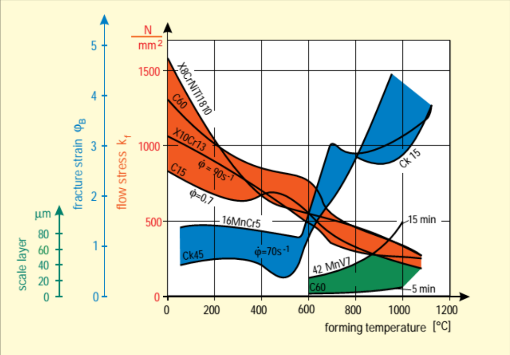
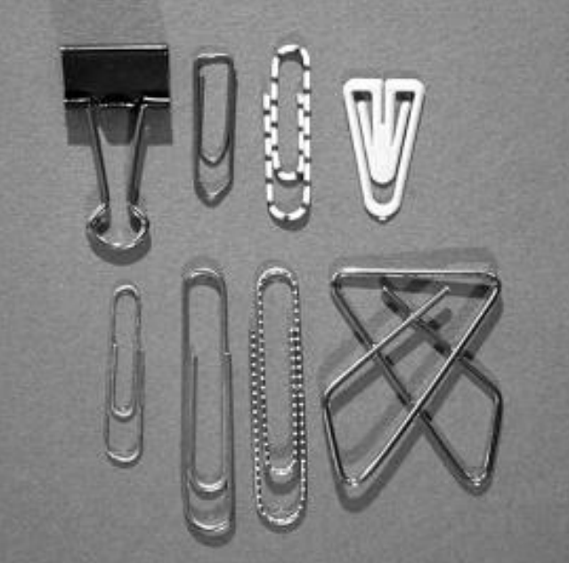
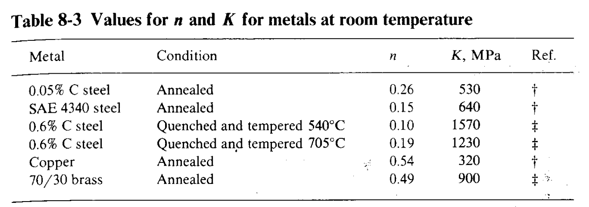
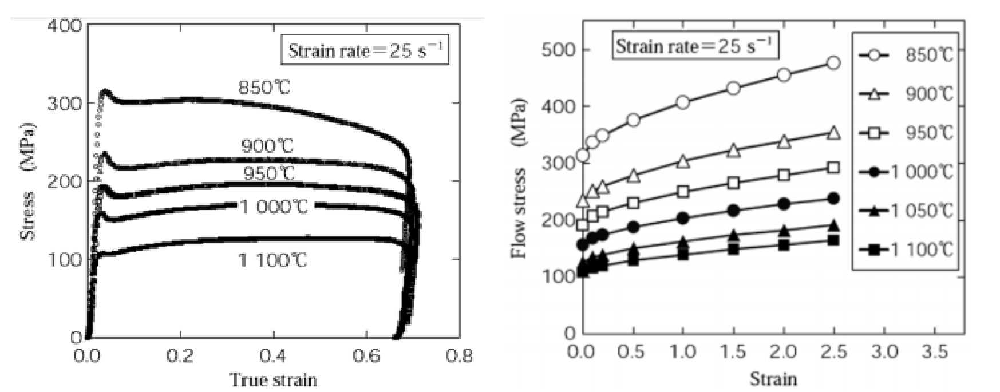

## Introducción a los procesos de deformación

1. Indique las ventajas y desventajas de realizar procesos de deformación con respecto a otros procesos de manufactura (fundición y remoción de material).
    
   **R:**

2. Indique la clasificación de los procesos de deformación volumétrica.
   
   **R:**
   
3. Indique la clasificación de procesos de deformación de láminas delgadas.
   
   **R:**
   
4. Indique la clasificación de los procesos de deformación en función de los esfuerzos y dé al menos cinco ejemplos de procesos con diferentes estados de esfuerzos.
   
   **R:**
   
5. Explique desde el punto de vista metalúrgico cuáles son las principales características de los procesos de deformación en frío y en caliente y a que temperatura se realiza cada uno de los anteriores.
   
   **R:**
   
6. En una tabla resumen explique las ventajas y desventajas de realizar procesos de deformación en frío y en caliente. Incluya aspectos tales como capacidad de los procesos, precisión, esfuerzos de flujo,étc.
   
   **R:**
   
7. Indique las principales características (partes principales del proceso, tipo de herramientas, superficies a generar, etc.) de los siguientes procesos: Forjado, trefilado, cizallado, extrusión, embutido, laminado y repujado.
   
   **R:** 
   
8. Indique la diferencia entre al menos 3 procesos diferentes de extrusión.
  
   **R:**
   

## Fundamentos de deformación en metales
1. De acuerdo con la ecuación, calcule la fuerza necesaria para realizar la extrusión de una tubería (defina usted en diámetro) de latón y acero a la misma temperatura.
   $$
   F = A_okln\bigg(\frac{A_o}{A_f}\bigg)
   $$   
   
   **R:**

   (este punto puede resolverse a partir de lo visto en la página 434 del kalpayan)
   
2.  Explique detalladamente la figura y determina las condiciones de procesamiento de un material tipo CK15 y CK60. La figura muestra varios aspectos importantes a la hora de seleccionar los parámetros de proceso de varios metales.
    
   
   **R:** 
   
   Esta gráfica representa el esfuerzo de flujo ($k_f$) en función de la temperatura para diferentes materiales.  
   Para los materiales de interés, se pueden leer las siguientes propiedades:

   **Esfuerzo de flujo:**
      - CK15: Se empieza a determinar un esfuerzo de flujo a partir de los 800°C.
      - C60: Existe un esfuerzo de flujo desde los 600°C...
   
   **Ideas:**
      - Esta gráfica es el punto de partida para calcular la temperatura de procesamiento, velocidad y tasa de deformación, e incluso espesor de óxido.
      - Identificar ¿dónde está la temp. de recristalización de los materiales?

   **Preguntas:**
      - Estos materiales no son metales convencionales, ya que su esfuerzo de flujo aumenta al aumentar su temperatura de formado. ¿Es esto cierto?
      - ¿Qué significa el término 'fracture strain'?
      - ¿Qué significan los colores, los valores en minutos, y los valores de $\dot{\phi}$?
      - ¿Cómo puedo ver la temperatura de recristalización para dichos materiales?

3.  Indique las operaciones necesarias para la fabricación de los productos mostrados.
   
   
   **R:**
   
4.  Defina 'formabilidad', y defina al menos dos formas de realizar la medición de esta propiedad tecnológica.
   
   **R:**
   
5. A partir de los valores de $n$ y $K$ para varios materiales a temperatura ambiente y cálculos (mostrados en la tabla), determine qué material es más fácil de formar entre el cobre puro y el latón.
   
   
   **R:**
   
6. Consulte las propiedades $K$ y $n$ de al menos 5 metales comunes (al menos dos aceros inoxidables y aceros al carbono).
   
   **R:**
   
7. Identifique las propiedades de $c$ y $m$ de al menos 5 matales comunes e identifique cómo varía $m$ para estos materiales con la temperatura.
   
   **R:**
   
8. La figura muestra dos gráficas importantes para la realización de cálculos para forjar una aleación de Titanio. Identifique las figuras y explique las diferencias entre las mismas. Explique por qué existen varios esfuerzos de flujo para una misma temperatura.
   
   
   **R:**
   
9.  Calcule la fuerza que debe ser empleada para forjar un cilindro de $3in$ de diámetro y $2in$ de altura para ser reducido de a un cilindro de $1in$. El material tiene una curva de fluencia definida por $K= 55000 lb/in^2$ y $n= 0.20$. Asuma un coeficiente de fricción de $0.2$.
   
   **R:**

   (Este ejercicio puede resolverse con la información del kalpayan, página 408. Fuerza de forjado)
   
10. Determine la dimensión del punzón a especificar en el corte de un disco de diámetro de 6 pulg a partir una lámina de acero laminado en frío de 1/8` de espesor con una resistencia a la tracción σt= 350 MPa.
   
   **R:**

   (ya resuelto)
   
11. En un proceso de manufactura fijo, identifique la diferencia  deformación y tasa de deformación e identifique distintos valores típicos para 5 procesos diferentes.
   
   **R:**
   
12. Identifique diferentes tipos de prensas usados en proceso de deformación de metales y en una tabla resumen escriba las ventajas y desventajas de cada una.
   
   **R:**
   
13. Explique que es el coeficiente de anisotropía y determine dos aplicaciones prácticas para la solución de defectos mediante la aplicación de este concepto.
   
   **R:**
   

## Laminado

1. Defina el proceso de laminado y explique sus ventajas y desventajas.
   
   **R:**
   
2. Determine la clasificación de los procesos de laminado (por geometría obtenida y geometría de los rodillos) y explique la diferencia entre palanquilla, tocho y planchón.
   
   **R:**
   
3. Identifique la diferencia entre láminas delgadas, placas, flejes, barras.
   
   **R:**
   
4. Calcule la fuerza normal y la potencia necesaria para reducir un 30% una lámina de acero de 12 pulgadas de ancho. Use como ayuda las tablas de las diapositivas de clase.
   
   **R:**
   
5. Identifique las ventajas de realizar laminados en roscas comparados con los procesos de remoción por viruta.
   
   **R:**
   
6.  Liste los defectos comúnmente observados en el laminado plano y determine su origen y posibles soluciones.
   
   **R:**
   
7. Explique cómo se producen los tubos sin costura.
   
   **R:**
   
8. Explique por qué el acabado superficial de un producto laminado es mejor en laminado en frío que en laminado en caliente y que porcentaje de mejora en propiedades es esperado.
   
   **R:**
   
9. Explique el funcionamiento del molino Sendzimir. ¿Cuáles son sus características importantes?
   
   **R:**
   
10. Explique cómo se invierten los patrones de esfuerzos residuales mostrados en la figura 13.9 del libro de kalpakjian cuando se cambia el radio del rodillo o la reducción por pase.
   
   **R:**
   
11. Identifique tres familias de materiales para rodillos de laminación y sus ventajas y desventajas.
   
   **R:**
   
12. Estime la fuerza de laminado (F) y el torque para una cinta de acero al carbón AISI 1020 que tiene 200 mm de ancho y 10 mm de espesor y que se lamina a un espesor de 7 mm. El radio del rodillo es de 200 mm y gira a 200 rpm.
   
   **R:**

   (puede resolverse con ecuaciones de laminado)
   

## Procesos de deformación de láminas delgadas

1. Identifique las ventajas y desventajas de los procesos de formación de láminas delgadas
   
   **R:**
   
2. Identique y explique brevemente 10 procesos de deformación de láminas delgadas.
   
   **R:**
   
3. Explique el término blanco y determine procesos para la obtención de blancos para el proceso de láminas delgadas.
   
   **R:**
   
4. Explique las principales partes de un troquel
   
   **R:**

