# Forjado

Es un proceso en el cual se comprime una pieza de trabajo entre dos matrices opuestas, de tal forma que su forma se imprima para obtener la pieza requerida.

**Importante:** El diseño de un proceso de forja implica diseñar el proceso de tal forma que las líneas de flujo se orienten en la dirección de los esfuerzos.

> El forjado se utiliza para elementos de altas prestaciones mecánicas, incluyendo la aplicación de cargas cíclicas.

**¿Por qué las piezas mecanizadas aguantan menos a la fatiga que las piezas forjadas?** Porque en el mecanizado la deformación en toda la interfase entre la pieza y la viruta es tan alta, que la superficie de la pieza también se encuentra deformada, a tal punto que la superficie de la pieza ya se encuentra sometida a esfuerzos altos

## Actividad

1. **Explique detalladamente los procesos de manufactura mediante forja con dado abierto.**

   El forjado con dado abierto o matriz abierta, consiste en la aplicación de esfuerzos de compresión de una pieza de trabajo sólida colocada entre dos matrices planas. Se subdivide en los siguientes procesos:
   - **Forjado con matriz plana:** Se coloca una pieza de trabajo (generalmente un cilindro o pieza con dos caras planas y opuestas) entre dos matrices planas y abiertas, y se somete la pieza a esfuerzos de compresión de tal forma que la pieza de trabajo aumente su espesor y disminuya su altura.  
    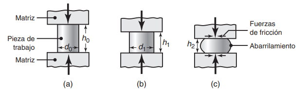

   - **Forjado de desbaste:** También conocida como _estirado_. Se coloca una barra larga o anillo de material entre dos matrices planas con poca área de contacto, se somete a esfuerzos de compresión (de tal forma que la pieza disminuya su área de sección transversal) y se empuja/gira la pieza, de tal forma que el proceso ocurra en toda la longitud de la pieza, efectivamente disminuyendo su área transversal.   
    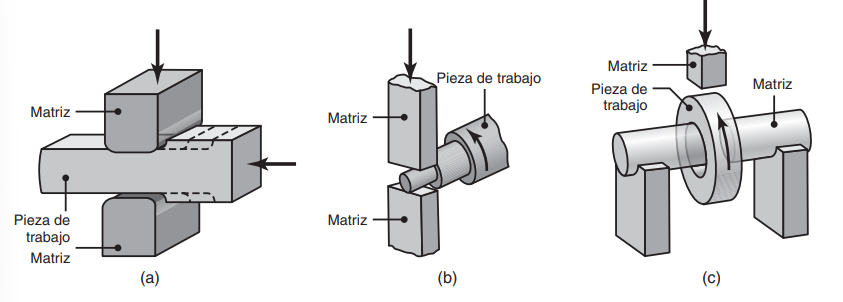

2. **¿Por qué las líneas de flujo son importantes en una pieza forjada, y por qué existen diferencias con una pieza obtenida por procesos de remoción de material?**

  Las líneas de flujo o _isodeformación_ son líneas que muestran el flujo de los granos del material a medida que éste fue deformado durante el proceso de forja. En el proceso de forjado, las líneas de flujo son continuas, implicando que la deformación en el material no fue tan alta que como en procesos de maquinado (donde las líneas de flujo se interrumpen). Dado que las deformaciones no son tan altas en el forjado, los esfuerzos a los que fue sometida la pieza durante el proceso no son tan altos como los del maquinado.

3. **¿Por qué es importante la formación de rebaba en los procesos de forjado?**

   La rebaba en los procesos de forjado representa una gran restricción al flujo del material hacia los extremos (ya que ésta sección es la primera en disminuir su ductilidad por enfriamiento o por restricción misma de la matriz). Dado que el material fluye hacia donde hay menos resistencia, el resto del material fluirá hacia el interior de la cavidad de la matriz durante el resto del proceso de forja.

   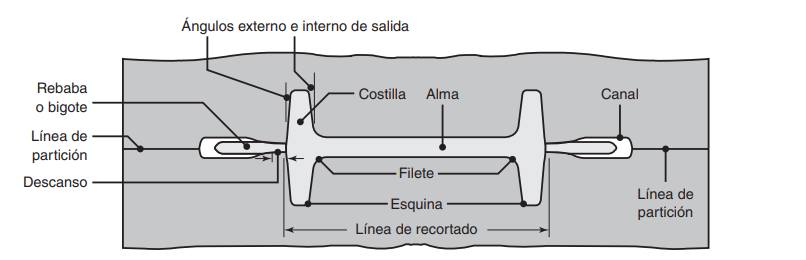

4. ¿Cuáles son las etapas del forjado desde que el dado entra en contacto con la pieza hasta que termina la forja?

   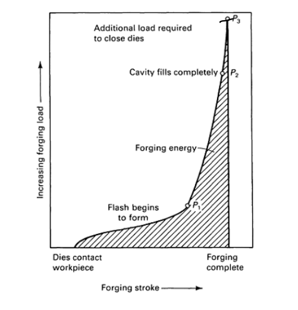

5. ¿Qué tipos de prensas se usan en procesos de forja y qué características, ventajas y desventajas tiene cada una?

   - **Prensa hidráulica:**
   
    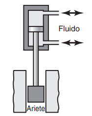

   | Características |
   |:---:|
   | **Velocidad:** Constante y controlable, entre 0.06 y 0.3m/s. |
   | **Fuerza:** Entre 125MN (forjado de matriz abierta) y 730MN (forjado de matriz cerrada). |
   | Carga limitada o restringida por la capacidad de la prensa. |
   | **Usos:** Piezas grandes con altísimo desempeño mecánico. |

   | Ventajas | Desventajas |
   |---|---|
   | Menor mantenimiento | Costos iniciales altos |
   |  | **Operación lenta**, facilitando el enfriamiento de las piezas y matrices en el forjado en caliente. |
   
   - **Prensa mecánica:** Son de tipo manivela o excéntricas

    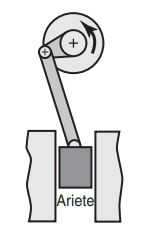

   | Características |
   |:---:|
   | **Velocidad:** Variable e impredecible, entre 0.06 y 1.5m/s. |
   | **Fuerza:** Entre 2.7 a 107MN. |
   | De recorrido o carrera limitada. |
   | **Usos:** Forjado de partes pequeñas y medianas de alta precisión |

   | Ventajas | Desventajas |
   |---|---|
   | Altas velocidades de producción | Una mala instalación puede causar deterioro o rompimiento del herramental. |
   | Facilidad de automatización |  |

   - **Prensa de tornillo:** Obtienen su energía de un volante de inercia que gira un tornillo

    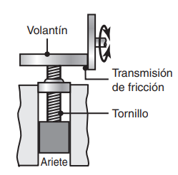

   | Características |
   |:---:|
   | **Velocidad:** Impredecible, entre 0.6 y 1.2m/s. |
   | **Fuerza:** Entre 1.4 y 280MN. |
   | De energía limitada. |
   | **Usos:** Forjado de matriz abierta o cerrada, especialmente el forjado de partes delgadas con alta precisión. |

   | Ventajas | Desventajas |
   |---|---|
   | Bajos costos iniciales | Pequeñas cantidades de producción. El forjado generalmente debe realizarse en varias pasadas. |

   - **Martillo de caída por gravedad:** Su energía corresponde con la energía potencial del ariete.

   | Características |
   |:---:|
   | **Velocidad:** Impredecible, entre 3.6 y 4.8m/s. |
   | **Fuerza:** Entre . |
   | De energía limitada. |
   | **Usos:** Forjado de matriz abierta o cerrada, especialmente útil en forjado en caliente con piezas complejas. |

   | Ventajas | Desventajas |
   |---|---|
   | Altas velocidades de operación | El forjado generalmente debe realizarse en varios golpes. |
   | Permiten el forjado de piezas complejas en caliente, ya que minimizan la pérdida de calor en las piezas y el herramental. |  |

   - **Martillo de caída mecánica:** Obtienen su energía de un volante de inercia.

   | Características |
   |:---:|
   | **Velocidad:** Impredecible, entre 3 y 9m/s. |
   | **Fuerza:** Entre 1.4 y 280MN. |
   | De energía limitada. |
   | **Usos:** Forjado de matriz abierta o cerrada, especialmente útil en forjado en caliente con piezas complejas. |

   | Ventajas | Desventajas |
   |---|---|
   |  |  |

   - **Contramartillo:** Obtienen su energía de un volante de inercia.

   | Características |
   |:---:|
   | **Velocidad:** Entre 4.5 y 9m/s. |
   | **Fuerza:** Entre MN. |
   | . |
   | **Usos:** Forjado de matriz abierta o cerrada. |

   | Ventajas | Desventajas |
   |---|---|
   |  |  |

6. ¿Cuál es el costo relativo por pieza en función de los principales parámetros del proceso? (costo del material, costo del setup, costo del herramental).

   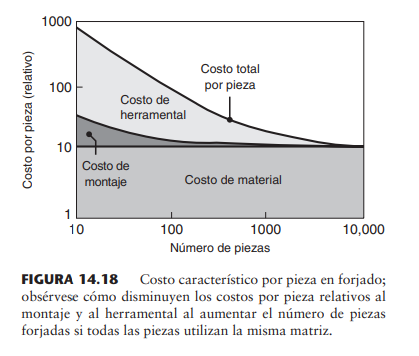

   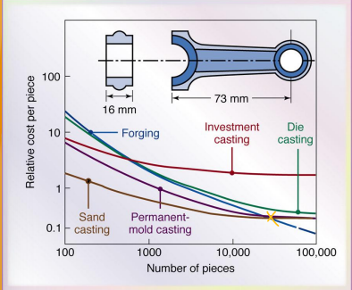

7. **¿Cómo se evalúa la forjabilidad por medio de la prueba de torsión en caliente?**

   La _prueba de torsión en caliente_ para evaluar forjabilidad consiste en torcer un espécimen redondo de manera continua en la misma dirección hasta que se rompe. Esta prueba se realiza a diferentes especímenes a diferentes temperaturas, graficando la cantidad de vueltas totales a las que se somete cada uno antes de romperse. **La temperatura a la que ocurra la máxima cantidad de vueltas se convierte en la temperatura de forjado que garantice la máxima forjabilidad**.

8. En piezas o herramientas forjadas las letras en la pieza sobresalen en vez de estar rebajadas. ¿por qué están producidas de esa manera?

    Esto se debe por la forma en la que se manufacturan las matrices para el forjado de dichas piezas. Las matrices son primero fundidas (para piezas grandes) o parten de un bloque de material forjado por forjado plano (para piezas pequeñas), y luego dichas piezas son maquinadas para obtener la geometría deseada. Existen tres razones para realizar las letras de esta forma: 1. Es más fácil maquinar las letras para que éstas sobresalgan de la pieza y no al revés. 2. Es posible que las letras tengan un mayor impacto en el desempeño de la pieza al actuar como concentradores de esfuerzos. 3. En el diseño de la matriz se requiere seguir ciertos parámetros de diseño respecto a ángulos de salida, que serían más difíciles de obtener si las letras estuvieran embebidas. 

9.  ¿Cuáles son los defectos más comunes en las operaciones de forjado? Explique posibles causas y soluciones. (**Ver sección 14.6 de diseño de matrices**).  
    
    **Abarrilamiento:** Es un defecto que consiste en el aumento de diámetro o espesor inesperado de la pieza en la zona más alejada de las matrices. Se da generalmente en el forjado con matriz plana.

    | Causa | Solución |
    |---|---|
    | Grandes fuerzas de fricción en las interfaces matriz-pieza de trabajo. | Uso de un lubricante eficaz. |
    | Forjado de piezas en caliente con matrices frías. | 1. Precalentar el herramental para evitar la pérdida de calor del material en el proceso. 2. Utilizar barreras térmicas entre las interfaces. |

    **Agrietamiento en la superficie:** Consiste en la formación de grietas en la superficie de la pieza de trabajo.

    | Causa | Solución |
    |---|---|
    | Insuficiente volumen de material para llenar completamente la matriz de forjado | Calcular e introducir correctamente el volúmen suficiente de material en la matriz. |

    **Agrietamiento interno:** Consiste en la formación de grietas internamente en la pieza de trabajo.

    | Causa | Solución |
    |---|---|
    | Exceso de volumen de material dentro de la matriz, ocasionando pliegues y grietas internas por las presiones en el proceso | Calcular e introducir correctamente el volúmen adecuado de material en la matriz. |

    **Plegamiento:** Consiste en la formación de pliegues dentro de la pieza de trabajo.
   
    | Causa | Solución |
    |---|---|
    | Insuficiente volumen de material para llenar completamente la matriz de forjado | Calcular e introducir correctamente el volúmen suficiente de material en la matriz. |

10. Explique las tres zonas típicamente observadas durante el forjado de un cilindro.
11. ¿Cómo puede saber si una pieza fue forjada o fundida? Explique las características que investigaría en la pieza.

12. Explique la clasificación de los procesos de forjado.

   Los procesos de forjado se clasifican en:
    - **Matriz abierta**
      - Forja de matriz plana
      - Forja de desbaste
      - Forjado orbital
      - Forjado progresivo
    - **Matriz cerrada**
      - Forja en matriz cerrada
      - Forja de precisión
      - Acuñado
    - **De aproximación o bloqueo:**
      - Cabeceado
      - Penetrado
      - Forjado rotatorio
      - Extrusión de tubos
    - **De precisión**

   > Ver norma DIN 8583-3 en las diapositivas

13. Describa capacidades y limitaciones de las prensas para forjado.

14. ¿Qué información importante puede obtener por medio de las líneas de isodeformación de los granos en una pieza forjada?

   Las líneas de isodeformación pueden dar información respecto a la dirección de forjado de la pieza, así como velocidades de deformación 
   
   Si las líneas de flujo llegan perpendicularmente a una de las superficies de la pieza, se exponen los límites de grano directamente al ambiente, desarrollando una superficie rugosa que puede convertirse en concentradora de esfuerzos.

   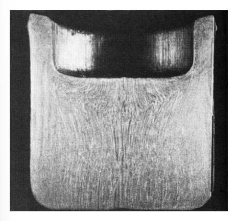

15. ¿Qué dificultades hay al definir con precisión el término 'forjabilidad'?

16. **¿Qué valores del diseño del canal para rebaba garantizan un adecuado llenado de la cavidad?**

   El diseño de una matriz de forjado implica evitar que la pieza de trabajo fluya hacia las rebabas para que la cavidad de la matriz se llene completamente. La rebaba sobrante fluye hacia un _canal_ para que ésta no aumente la carga durante el proceso. **Dicha holgura para el canal debe ser del 3% del espesor máximo de la forja, y su longitud debe ser de dos a cinco veces el espesor de la rebaba.**

17. ¿Cuál es la fuerza de forjado de una pieza de trabajo sólida, cilíndrica, producida con acero 1020, que tiene 3.5in de altura y 5 in de diámetro, y cuya altura se va a reducir 30%. Considere un coef. de fricción de 0.2.

   **Fuerza de forjado** en una operación de forjado de matriz abierta de una pieza sólida cilíndrica:
   $$
     F = Y_f\pi r^2\Big(1+\frac{2\mu r}{3h}\Big)
   $$
   Con:
    - $Y_f$: Esfuerzo de flujo del material.
    - $\mu$: Coeficiente de fricción entre la pieza de trabajo y la matriz.
    - $r, h$: Radio y altura de la pieza de trabajo, respectivamente.
  <!-- 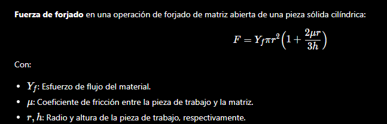 -->

1.  En la figura P14.36 se muestra una forja redonda por impresión de matriz producida con una pieza en bruto cilíndrica, como se muestra a la izquierda. Conforme a lo descrito en este capítulo, dichas partes están hechas en una secuencia de operaciones deforjado. Sugiera una secuencia de pasos intermedios de forjado para hacer la parte de la derecha y dibuje la forma de las matrices requeridas.
2.  ¿Qué tipo de lubricantes se usan en los procesos de forjado?
    
    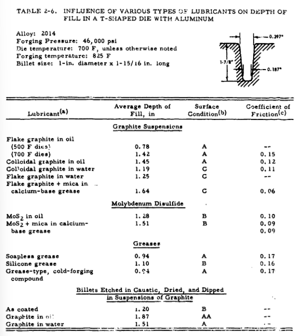

## Preguntas
1. Suponga que trabaja en una empresa que fabrica armas de caza y necesita manufacturar el cañón del arma. El cañón tiene unos 50 o 60 cm de largo, y debe tener las geometrías internas mostradas en la siguiente figura. ¿Bajo qué proceso de forjado lo manufacturaría? Describa el proceso y sus piezas principales

   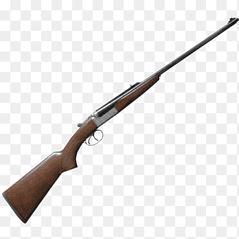
   
   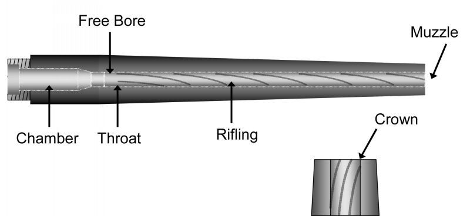

## Ideas

Existe forja en caliente y en frío, lenta o por impacto. ¿De qué dependen estos parámetros?

## Para investigar
- ¿Qué son las líneas de flujo? Es una línea de isodeformación, ya que en la forja se controla la deformación.
- Criterios de diseño: Vida finita o infinita
- Buscar la hoja de vida del profesor (CvLac) y buscar el artículo del cigüeñal de ENCA.
- ¿Qué son los esfuerzos residuales?