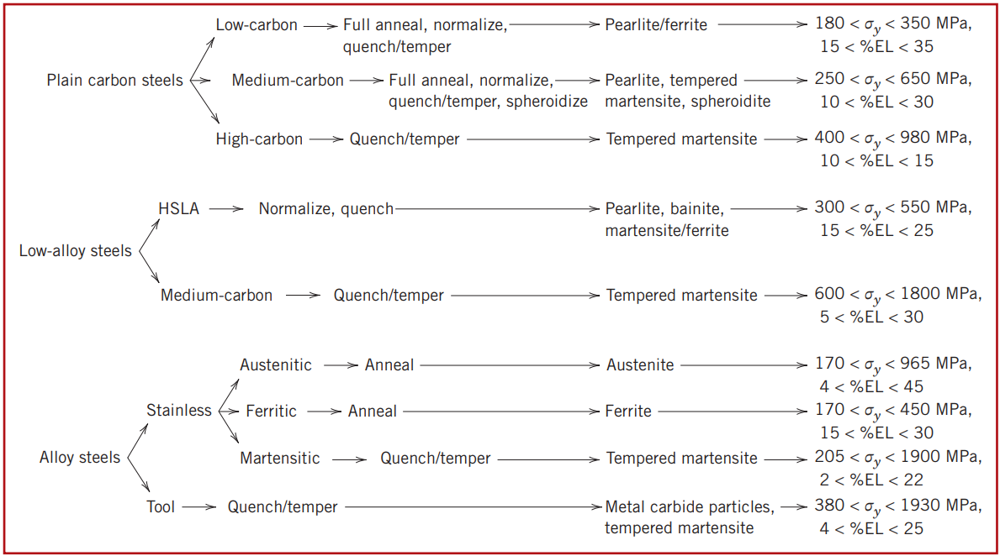

Los tratamientos térmicos en metales, especialmente en aceros, pueden cambiar sus características y propiedades dependiendo de la aplicación en la que se quieran utilizar. Generalmente, las variables a considerar en tratamientos térmicos son las etapas del proceso, temperaturas y tiempos de duración.

   
_**Figura 11.25:** Resumen de tratamientos térmicos posibles a realizar para cada tipo de acero y sus principales propiedades esperadas._

A continuación se muestran diferentes tratamientos realizados en metales:

## Recocido (_Annealing_)

El material se expone a una temperatura elevada por un largo periodo de tiempo y se enfría lentamente, usualmente a temperatura ambiente.

**Usos:**
- Aliviar esfuerzos internos en la pieza.
- Disminuir la dureza del material, aumentar su ductilidad y su tenacidad. Esto permite, por ejemplo, facilitar su mecanizabilidad
- Producir cierta microestructura.

> Cambios grandes y abruptos de temperatura, influyendo sobre geometrías grandes de la pieza, pueden ocasionar considerables gradientes de temperatura dentro de la misma, llevando a esfuerzos internos que pueden producir deformaciones o fracturas.

_(Completar de libro de Callister, pág. 401)_

---

Los procesos de recocido en aceros obedecen a los siguientes gráficos:

  
_**Figura 11.14:** Diagrama de fases Fe-C en las cercanías de la composición eutectoide, indicando los rangos de temperatura para aceros al carbono no aleados._

   
_**Figura 10.27:** Curvas de enfriamiento lento y moderadamente rápido sobre la curva CCT de un acero eutectoide._

### Normalizado (_Normalizing_)

Tratamiento térmico utilizado para refinar el grano (disminuir el tamaño promedio de grano) y producir una distribución cristalina más uniforme.

**Resultados:** Perlita fina, y cualquier otra fase proeutectoide, si es el caso.

**Usos:**
- Revertir el historial térmico del material, ayudando a predecir mejor su comportamiento.
- Reducir tensiones internas en la pieza luego de procesos de deformación o soldadura.
- Aumentar la ductilidad del material, mejorando su capacidad de deformación.
- Preparar el material para procesos posteriores, como el templado y el revenido, y mejorar la predictibilidad en su comportamiento.

**Procedimiento:**
1. **Austenizado:** Calentar y mantener el material a una temperatura de al menos 55°C superior a la temperatura superior crítica; es decir, por encima de $A_3$ para composiciones menores a la eutectoide (0.76 wt% C) y por encima de $A_{cm}$ para composiciones mayores a la eutectoide, hasta que se forme _austenita_ en toda la pieza.
2. **Enfriado moderadamente rápido:** Enfriar a temperatura ambiente en aire hasta obtener _perlita fina_.

### Recocido total (_Full annealing_)

Tratamiento térmico utilizado en aceros de medio carbono para aumentar considerablemente la ductilidad y tenacidad de las piezas.

**Resultados:** Produce Perlita gruesa, y cualquier otra fase proeutectoide, si es el caso.

**Usos:**
- Mejorar la ductilidad y disminuir la dureza del material para procesos de mecanizado o procesos de alta deformación plástica.

**Procedimiento:**
1. **Austenizado:** Calentar el material a al menos 50°C de la temperatura $A_3$ para composiciones menores a la eutectoide (para formar _austenita_), o 50°C para mayores a la eutectoide sobre la línea $A_1$ (para formar _austenita_ y _cementita_).
2. **Enfriamiento lento:** Enfriar el material dentro del mismo horno del tratamiento, dejando enfriar el horno a temperatura ambiente, para formar _perlita gruesa_ y cualquier otra fase en composición proeutectoide.

### Esferoidización (_Spheroidizing_)

Tratamiento térmico aplicado a aceros de medio y alto carbono, que permite obtener la máxima ductilidad y blandura.

**Resultados:** Perlita gruesa, junto con la esferoidización de la _cementita_ presente en la pieza.

**Usos:**
- Maximizar la ductilidad y blandura de aceros de medio y alto carbono para maximizar su mecanizabilidad y capacidad de deformación plástica.

**Procedimiento:**
1. Calentar la pieza a temperaturas justo menores a la eutectoide (línea $A_1$) en la región $\alpha + Fe_3C$ del diagrama de fases.
2. Calentar a una temperatura justo mayor a la eutectoide, y enfriando muy lentamente en el horno, o disminuyendo la temperatura a una justo menor a la eutectoide.
3. Calentar y enfriar a temperaturas entre +/- 50°C de la línea $A_1$.

## Tratamientos térmicos

