## 1. Análisis de señales

Esta actividad permitirá identificar patrones en las señales con ayuda de funciones de Matlab. Para cada caso responda las siguientes preguntas

1. Compare la diferencia de la señal temporal y el espectro al modificar las frecuencias a 250Hz y 4000Hz. Con la frecuencia de 250Hz evalúe los efectos de modificar muestreo  600, 100 y 10000. ¿Qué figuras se obtuvieron?

   **R.** Tomando la señal temporal y espectro de frecuencias a las siguientes frecuencias:

   - 250Hz y muestreo de 600 datos: Pueden verse dos picos definidos a 250Hz (amplitud 0.4) y a 410Hz (amplitud 0.6). Este es un error, ya que la onda original es de 250Hz, pero la tasa de muestreo dibujó una señal temporal errónea, y por lo tanto el análisis de frecuencia es erróneo.
    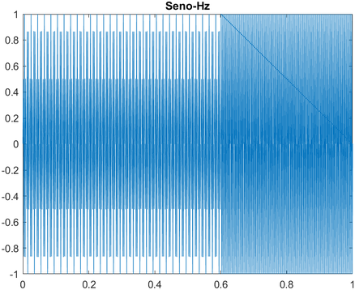
    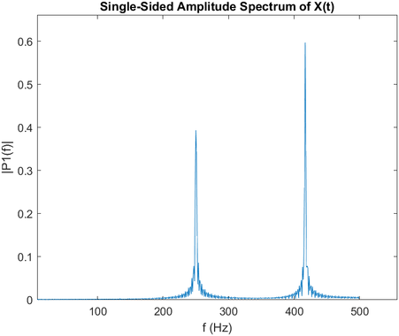
   - 250Hz y muestreo de 1000 datos: Puede verse un pico definido de 250Hz, con una amplitud de casi 0.9. Esta amplitud no es igual a la del seno, ya que el muestreo no es tan bien definido.
    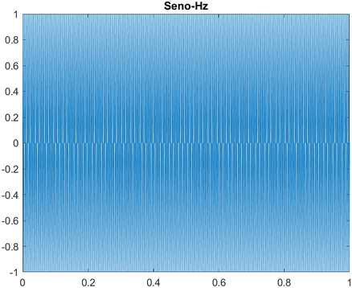
    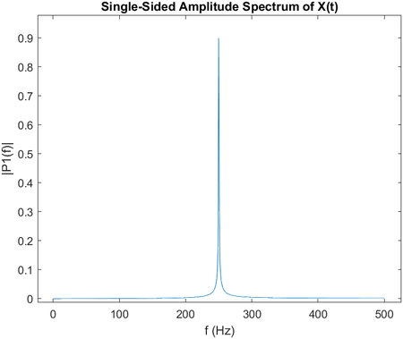
   - 250Hz y muestreo de 10000 datos: Puede verse un pico definido a 250Hz, con una amplitud casi igual a 1, ya que el muestreo de datos es muy bien definido.
    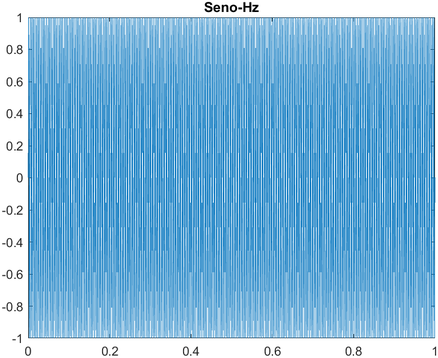
    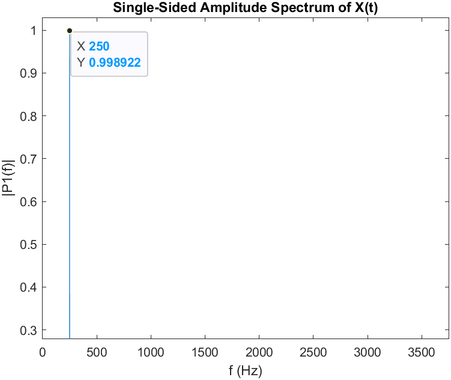

   **Conclusión:** Tanto los picos encontrados como la amplitud de la señal encontrada dependen de la capacidad del sensor para captar la información. A mayor tasa de muestreo, mejor va a ser el análisis realizado.

2. Genere una señal sinusoidal temporal de baja frecuencia y baja amplitud. Modifique la frecuencia a 1 y 50Hz. Explique los resultados de la señal temporal y los espectros.
   
   **R.** Hallando la señal temporal y en frecuencia:

   - Frecuencia de 1Hz. Muestreo de 200: Puede verse que las bajas amplitudes se detectan correctamente, ya que se detecta un pico a 1Hz de amplitud 0.1 en el espectro.
    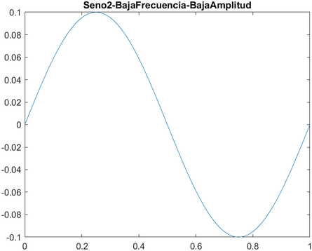
    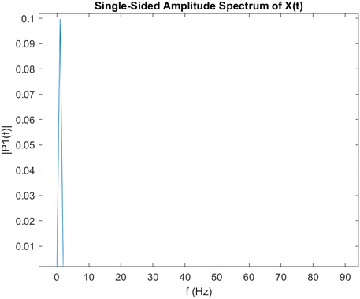
   - Frecuencia de 50Hz. Muestreo de 200: Puede verse un pico a 50Hz en el análisis espectral, sin embargo, su amplitud no está bien definida.
    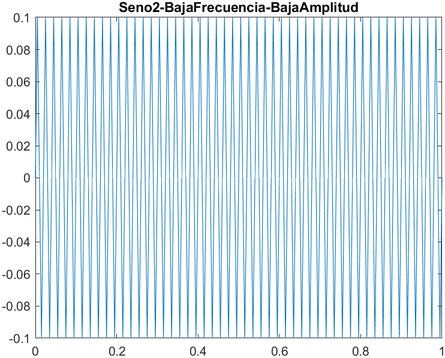
    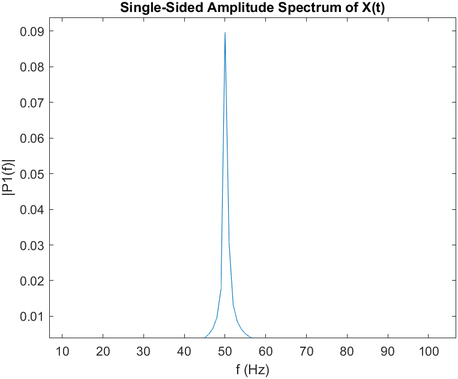

3. Genere una señal sinusoidal de alta frecuencia y alta amplitud. Modifique la frecuencia a 1 y 50Hz. Explique los resultados comparando las señales temporales y los espectros.
   
   **R.**
   - Frecuencia de 1Hz. Muestreo de 20000 datos y amplitud de 200: Puede verse claramente un pico a 1Hz, con la amplitud correctamente definida a 200.
    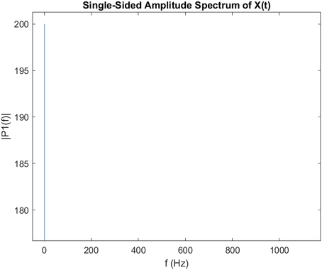
   - Frecuencia de 50Hz. Muestreo de 20000 datos y amplitud de 200: Puede verse claramente un pico a 50Hz, con una amplitud muy cercana a 200.
    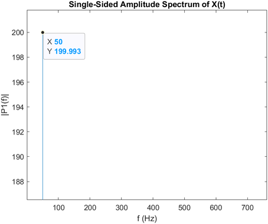

4. Genere una onda sinusoidal compuesta de varias ondas a diferentes frecuencias (50, 550 y 1250 Hz). ¿Por qué puede decirse que esta onda es estacionaria con diferentes frecuencias?
   
   **R.** Se muestra el fragmento 1/16 de la señal sinusoidal temporal encontrada y el espectro de frecuencias encontrado para dicha señal utilizando la transformada de fourier:

   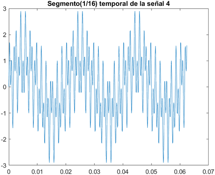
   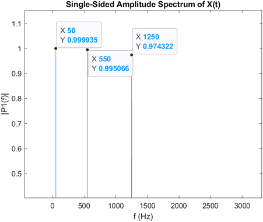

   Pueden verse tres picos definidos, con las tres frecuencias de las que está compuesta la onda (50Hz, 550Hz y 1250Hz). Esta onda es estacionaria ya que su comportamiento no cambia en el tiempo (es decir, su frecuencia y amplitud se mantiene constante en el tiempo).

5. Grafique una señal sinusoidal con frecuencias cercanas. Describa el caso de los segmentos de señal obtenidos con amplitudes 1, 1, 1 y 0.25, 1, 0.25. ¿Cómo es el espectro de Fourier?
   
   **R.** Dibujando la señal temporal compuesta por tres senos a 550, 600 y 650Hz; con las amplitudes demostradas a continuación:
   - Amplitudes 1, 1, 1; respectivamente: 
   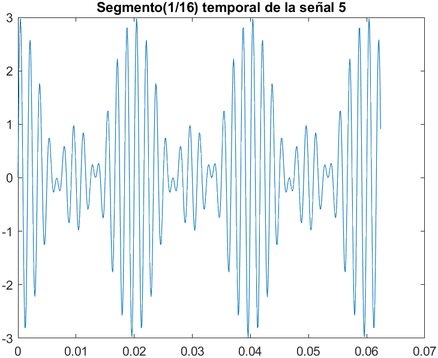
   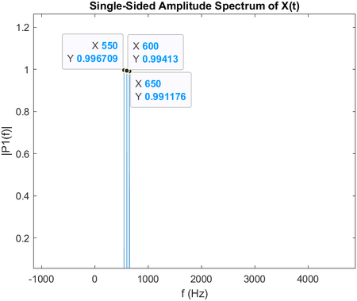

   - Amplitudes 0.25, 1, 1; respectivamente:
   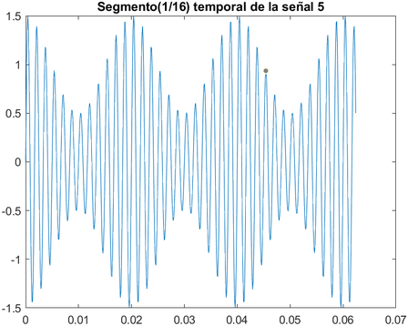
   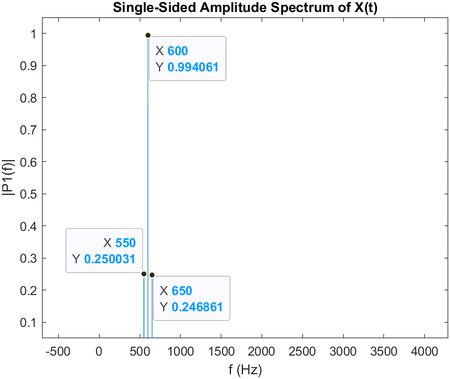

6. Grafique una señal sinusoidal no estacionaria con amplitud diferente y la misma frecuencia. Para este caso, ¿qué implica que la señal sea no estacionaria desde la señal temporal y desde el espectro de frecuencias?

   **R.** Puede verse que la señal cambia de amplitud en el tiempo t = 0.5; además, a pesar de que se ve un pico en la frecuencia 1750Hz, puede verse que dicho pico está compuesto por una onda sinusoidal.
   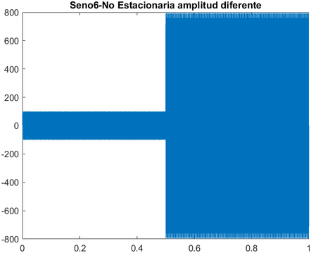
   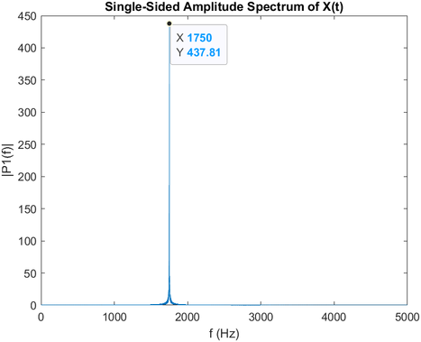
   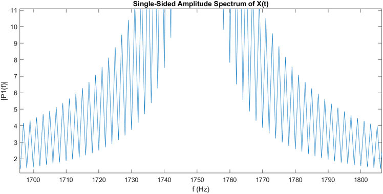

   La señal es no estacionaria, ya que ésta cambia con el tiempo, si ésta es analizada en el tiempo $0s<t<1s$.

7. Grafique una señal sinusoidal no estacionaria con frecuencias y amplitudes diferentes. Para este caso, ¿qué implica que la señal sea no estacionaria desde la señal temporal y el espectro de frecuencias?

   **R.** La señal temporal cambia en t = 0.5 desde una frecuencia de 1750Hz a una de 1950Hz, con amplitudes de 100 a 800, respectivamente.
   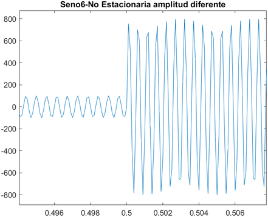

   Esto puede verse en el espectro de frecuencias; sin embargo, las amplitudes para la onda no estacionaria no corresponden con las amplitudes reales, y el pico obtenido está compuesto por ondas sinusoidales compuestas.
   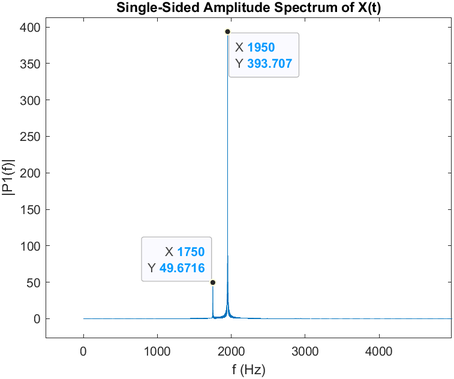
   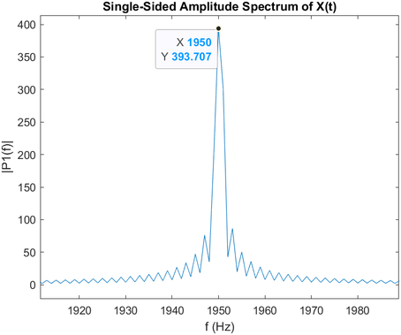

8. Grafique una señal de impacto que simula el paso de una esfera de rodamiento por un defecto en la pista. Analice las siguientes imágenes:
   1. 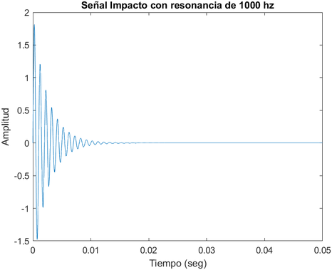
   
      **R.** Esta forma se genera por un impacto amorgiguado, ya que la amplitud de la onda, aunque mantiene su frecuencia, se va haciendo cada vez más pequeña.

   2. 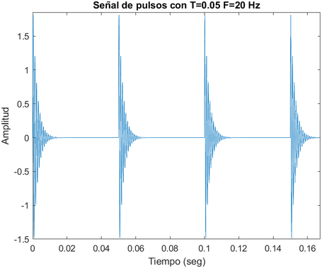
   
      **R.** Esta forma de onda se genera por varios impactos amortiguados igualmente espaciados.

   3. 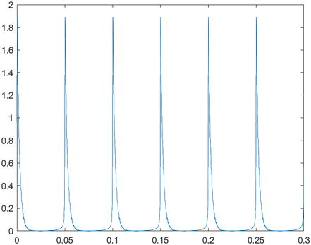

      **R.** 

   4. 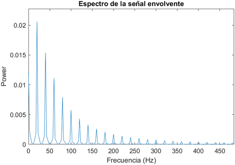
   
      **R.** Este es el espectro de la señal envolvente de una señal temporal cuya frecuencia natural es de alrededor 20Hz, y sus armónicos van disminuyendo en amplitud.
9.  