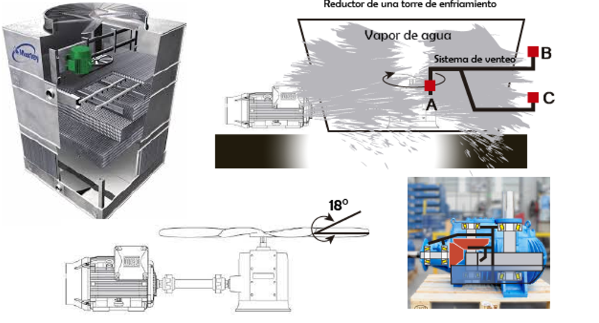

Considere el reductor de velocidad de una torre de enfriamiento. Analice las condiciones de operación y responda las preguntas siguientes:

## Condiciones de operación

**Descripción del equipo:**
- El reductor consiste en una única etapa de reducción. El eje de salida es perpendicular al eje de entrada, siendo este último horizontal.
- Tubería interna de circulación de aceite en cobre.

**Eje de entrada:**
- Potencia del motor: $250HP = 186.5kW$
- Potencia de entrada: $186.5kW - 2P_{fricción,rodamientos} = 186.127kW$
- Velocidad: $1800rpm; \frac{1800rev}{1min}\cdot\frac{2\pi}{1rev}\cdot\frac{60s}{1min} = 188.4rad/s$
- Torque de entrada: $T_{in} = \frac{188500W}{188.4rad/s} = 989.91N.m$

**Eje de salida:**
- Relación de transmisión: 1 a 7
- Torque de salida: $989.91Nm \cdot7 = 6929Nm$
- Velocidad de salida: $1800rpm/7 = 257rpm$

**Operación:**
- Lubricante: Aceite mineral grado ISO 220 EP1. Base lubricante: Grupo 1. Modificador de fricción con capacidad de carga de 200kgf en 4 bolas (norma ASTM D2783).
- Temperatura de operación: $110°C$. Temperatura en el cárter: $90°C$.

## Preguntas

1. Si usted considera que el reductor está operando con baja confiabilidad, enumere y explique los cambios correctivos que efecturaría para resolver este problema. Enumérelos en orden lógico.

  **R.** El reductor efectivamente está operando con baja confiabilidad, ya que se sabe que la temperatura del aceite en el cárter es de 90°C y, asumiendo un aumento de 20°C, la temperatura en la zona de fricción es de 110°C. Esto significa que el reductor trabaja en condiciones por fuera del rango _OC_ (operación confiable). Además, se sabe que la tubería interna es de cobre, por lo que se puede reduce considerablemente la vida útil del lubricante.   
  A continuación, se enumeran los cambios correctivos para asegurar un correcto funcionamiento del reductor:

   - **Cambio del lubricante:** Asumiendo que el reductor está bien diseñado, se intuye que la alta temperatura en la zona de fricción se produce porque el lubricante seleccionado no corresponde con las velocidades de operación de la máquina. El aceite mineral ISO 220 funciona para un rango de velocidades de entre 300 a 500rpm, y claramente el reductor no opera bajo estas velocidades (1800rpm para el eje de entrada, y 257rpm para el de salida). Esto produce que no se mantenga la película de lubricante en la zona de contacto, y se aumente la temperatura por fricción metal-metal. Además, el cambio de lubricante de mineral a sintético podría reducir directamente la temperatura de la zona de fricción en 10°C; por lo que esta opción debería revisarse en términos económicos.
   - **Cambio de la tubería interna:** El cobre, al ser un metal catalizador, puede reaccionar con el lubricante, degradándolo y deteriorándolo, por lo que aumentaría la fricción y el desgaste en los componentes internos del reductor.

2. Determine el tipo de fricción y de lubricación en los rodamientos del eje de entrada y salida.

  **R.** 

  **Eje de entrada:** El eje gira a 1800rpm. La fricción es fluída, y la lubricación es Hidrodinámica (LHD). La capa fluida 3 se encuentra al 100%.

  **Eje de salida:** El eje gira a 257rpm. La fricción es mixta, con un 30% fricción sólida, y un 70% fricción fluida (igual que la capa fluida 3). La lubricación es Elastohidrodinámica (EHD).

3. Especifique cuál es el sistema de venteo correcto y explique por qué.

  **R.**

4. Si se opta por cambiar el aceite mineral de grado ISO 220 EP1 con un índice de viscosidad IV de 108, utilizado actualmente en el reductor, por un aceite sintético. Especifique el tipo, categoría, grado ISO y la capacidad de carga del modificador de fricción que debe tener el aceite sintético.

  **R.** 

5. Calcule el ahorro económico por mes en el consumo de energía por menor fricción en el reductor al pasar de un aceite mineral a un aceite sintético. El reductor de velocidad opera a 720 horas por mes, y el costo del kWh/mes es de 220 pesos.

  **R.**

6. Al implementar el aceite sintético en la lubricación del reductor, ¿es factible que la temperatura de operación en la zona de fricción quede en, o por debajo de 65°C? Explique por qué. De no ser así, ¿cuál es la solución para que quede en 55°C y ¿cuál es el grado ISO y el modificador de fricción cuando se implemente esta solución?

  **R.**

7. ¿Qué ventajas tiene un aceite sintético tipo PAG con respecto a un aceite sintético PAO en la lubricación del reductor?

  **R.**

  